# Mapa de Arquitectura del Proyecto (Grafo de Dependencias)

Este documento detalla visual y técnicamente las relaciones e interacciones entre los diferentes componentes del proyecto **My Local Picture**, incorporando los flujos de optimización de monetización y acoplamiento dinámico de metadatos SEO.

---

## 1. Grafo de Dependencias y Componentes (Mermaid)

```mermaid
graph TD
    %% Clases de estilo
    classDef html fill:#f97316,stroke:#ea580c,stroke-width:2px,color:#fff;
    classDef js fill:#eab308,stroke:#ca8a04,stroke-width:2px,color:#fff;
    classDef css fill:#3b82f6,stroke:#2563eb,stroke-width:2px,color:#fff;
    classDef py fill:#10b981,stroke:#059669,stroke-width:2px,color:#fff;
    classDef lib fill:#a855f7,stroke:#9333ea,stroke-width:2px,color:#fff;
    classDef flow fill:#06b6d4,stroke:#0891b2,stroke-width:2px,color:#fff;

    %% Nodos HTML
    RaizHtml["index.html (ES)"]:::html
    EnHtml["en/index.html (EN)"]:::html
    JaHtml["ja/index.html (JA)"]:::html
    ZhHtml["zh/index.html (ZH)"]:::html
    
    JpgPngHtml["jpg-a-png/index.html"]:::html
    PngJpgHtml["png-a-jpg/index.html"]:::html
    WebpJpgHtml["webp-a-jpg/index.html"]:::html
    WebpPngHtml["webp-a-png/index.html"]:::html
    WebpHtml["convertir-a-webp/index.html"]:::html
    HeicJpgHtml["convertir-heic-a-jpg/index.html"]:::html
    HeicPngHtml["heic-a-png/index.html"]:::html
    SvgImgHtml["svg-a-imagen/index.html"]:::html
    SvgJpgHtml["svg-a-jpg/index.html"]:::html
    UniversalHtml["convertidor-universal/index.html"]:::html
    CompressHtml["comprimir-imagenes/index.html"]:::html
    ResizeHtml["redimensionar-imagenes/index.html"]:::html
    CropHtml["recortar-imagen/index.html"]:::html
    RotateHtml["rotar-imagen/index.html"]:::html
    FaviconHtml["generador-favicon/index.html"]:::html
    MidjourneyHtml["dividir-cuadricula-midjourney/index.html"]:::html
    GeminiHtml["quitar-marca-agua-gemini/index.html"]:::html
    DalleHtml["quitar-marca-agua-dalle/index.html"]:::html
    ImgPdfHtml["imagenes-a-pdf/index.html"]:::html
    PdfImgHtml["pdf-a-imagenes/index.html"]:::html
    PdfJpgHtml["pdf-a-jpg/index.html"]:::html

    %% Nodos JS Comunes
    ThemeJs["assets/theme.js"]:::js
    
    %% Nodos JS Herramientas
    AppJs["assets/app.js"]:::js
    PngJpgJs["assets/png-to-jpg.js"]:::js
    WebpJpgJs["assets/webp-to-jpg.js"]:::js
    WebpPngJs["assets/webp-to-png.js"]:::js
    WebpJs["assets/convert-to-webp.js"]:::js
    HeicJs["assets/heic-to-jpg.js"]:::js
    SvgImgJs["assets/svg-to-image.js"]:::js
    SvgJpgJs["assets/svg-to-jpg.js"]:::js
    UniversalJs["assets/universal.js"]:::js
    CompressJs["assets/compressor.js"]:::js
    ResizeJs["assets/resizer.js"]:::js
    CropJs["assets/crop-image.js"]:::js
    RotateJs["assets/rotate-image.js"]:::js
    FaviconJs["assets/favicon-generator.js"]:::js
    MidjourneyJs["assets/midjourney-splitter.js"]:::js
    GeminiJs["assets/watermark-remover.js"]:::js
    DalleJs["assets/watermark-remover-dalle.js"]:::js
    ImgPdfJs["assets/images-to-pdf.js"]:::js
    PdfImgJs["assets/pdf-to-images.js"]:::js
    PdfJpgJs["assets/pdf-to-jpg.js"]:::js

    %% Librerías Externas
    Heic2Any["assets/heic2any.min.js"]:::lib
    OpenCV["CDN: opencv.js (Inpaint Telea)"]:::lib
    JsPdf["assets/jspdf.umd.min.js"]:::lib
    JsZip["assets/jszip.min.js"]:::lib
    PdfJsLib["assets/pdf.min.mjs"]:::lib
    PdfWorker["assets/pdf.worker.min.mjs"]:::lib

    %% Flujos de Retención y Optimización Comercial (theme.js)
    CanvasIntercept["toBlob Interceptor <br> (Delay 2.5s)"]:::flow
    PdfIntercept["save PDF Interceptor <br> (Delay 2.5s)"]:::flow
    AdSense["Google AdSense <br> (Impression Boost)"]:::flow
    SearchIndex["Buscador Dinámico <br> (setupGlobalSearch)"]:::flow

    %% Automatización Python
    PythonScript["update_partials.py"]:::py
    PartialsES["partials/header_es.html <br> partials/footer_es.html"]:::html
    PartialsEN["partials/header_en.html <br> partials/footer_en.html"]:::html
    PartialsJA["partials/header_ja.html <br> partials/footer_ja.html"]:::html
    PartialsZH["partials/header_zh.html <br> partials/footer_zh.html"]:::html

    %% Relaciones de automatización Python
    PythonScript -->|Inyecta plantillas y calcula BASE_PATH| RaizHtml
    PythonScript -->|Inyecta plantillas y calcula BASE_PATH| EnHtml
    PythonScript -->|Inyecta plantillas y calcula BASE_PATH| JaHtml
    PythonScript -->|Inyecta plantillas y calcula BASE_PATH| ZhHtml
    PartialsES -.-> PythonScript
    PartialsEN -.-> PythonScript
    PartialsJA -.-> PythonScript
    PartialsZH -.-> PythonScript

    %% Relaciones HTML -> JS Común y Estilos
    RaizHtml --> ThemeJs
    EnHtml --> ThemeJs
    JaHtml --> ThemeJs
    ZhHtml --> ThemeJs
    
    JpgPngHtml --> ThemeJs
    PngJpgHtml --> ThemeJs
    WebpJpgHtml --> ThemeJs
    WebpPngHtml --> ThemeJs
    WebpHtml --> ThemeJs
    HeicJpgHtml --> ThemeJs
    HeicPngHtml --> ThemeJs
    SvgImgHtml --> ThemeJs
    SvgJpgHtml --> ThemeJs
    UniversalHtml --> ThemeJs
    CompressHtml --> ThemeJs
    ResizeHtml --> ThemeJs
    CropHtml --> ThemeJs
    RotateHtml --> ThemeJs
    FaviconHtml --> ThemeJs
    MidjourneyHtml --> ThemeJs
    GeminiHtml --> ThemeJs
    DalleHtml --> ThemeJs
    ImgPdfHtml --> ThemeJs
    PdfImgHtml --> ThemeJs
    PdfJpgHtml --> ThemeJs

    %% Relaciones HTML -> JS Herramienta
    JpgPngHtml --> AppJs
    PngJpgHtml --> PngJpgJs
    WebpJpgHtml --> WebpJpgJs
    WebpPngHtml --> WebpPngJs
    WebpHtml --> WebpJs
    HeicJpgHtml --> HeicJs
    HeicPngHtml --> HeicJs
    SvgImgHtml --> SvgImgJs
    SvgJpgHtml --> SvgJpgJs
    UniversalHtml --> UniversalJs
    CompressHtml --> CompressJs
    ResizeHtml --> ResizeJs
    CropHtml --> CropJs
    RotateHtml --> RotateJs
    FaviconHtml --> FaviconJs
    MidjourneyHtml --> MidjourneyJs
    GeminiHtml --> GeminiJs
    DalleHtml --> DalleJs
    ImgPdfHtml --> ImgPdfJs
    PdfImgHtml --> PdfImgJs
    PdfJpgHtml --> PdfJpgJs

    %% Interceptores de theme.js en el ciclo de vida del Canvas y PDF
    ThemeJs --> CanvasIntercept
    ThemeJs --> PdfIntercept
    CanvasIntercept -.->|Ralentiza exportaciones de| AppJs
    CanvasIntercept -.->|Ralentiza exportaciones de| UniversalJs
    CanvasIntercept -.->|Ralentiza exportaciones de| WebpJs
    PdfIntercept -.->|Ralentiza compilación de| ImgPdfJs
    
    %% Flujo Comercial
    CanvasIntercept -->|Incrementa exposición| AdSense
    PdfIntercept -->|Incrementa exposición| AdSense

    %% Acoplamiento de buscador dinámico
    JpgPngHtml -.->|Menu dropdown en DOM| SearchIndex
    ThemeJs --> SearchIndex

    %% Relaciones HTML/JS -> Librerías
    HeicJs -->|Carga dinámica| Heic2Any
    GeminiHtml -->|Importa CDN| OpenCV
    GeminiJs -.-> OpenCV
    ImgPdfJs -->|Carga dinámica| JsPdf
    CompressJs -->|Carga dinámica| JsZip
    PdfImgJs -->|Importa dinámicamente| PdfJsLib
    PdfJpgJs -->|Importa dinámicamente| PdfJsLib
    PdfJsLib -->|Usa como background worker| PdfWorker
```

---

## 2. Descripción de Componentes del Grafo

### 2.1. Nivel de Entrada (Landings Multiidioma)
- **[index.html](file:///d:/Descargas/Desarrollo%20de%20aplicaciones/converter/index.html)** y sus equivalentes de idioma: Son las puertas de entrada al sistema. No procesan imágenes directamente, sino que contienen el buscador interactivo de escritorio y móvil e indexan las herramientas. Cargan [theme.js](file:///d:/Descargas/Desarrollo%20de%20aplicaciones/converter/assets/theme.js) para controlar el buscador e inicializar en segundo plano Analytics y AdSense.

### 2.2. Script Python de Sincronización
- **[update_partials.py](file:///d:/Descargas/Desarrollo%20de%20aplicaciones/converter/update_partials.py)**: Este script procesa en lote todos los archivos HTML. Inyecta los componentes comunes desde las plantillas HTML en [partials/](file:///d:/Descargas/Desarrollo%20de%20aplicaciones/converter/partials/) basándose en el idioma de la carpeta de destino (`es`, `en`, `ja`, `zh`) y calcula las rutas relativas inyectando `{{BASE_PATH}}`.

### 2.3. Capa de Lógica Global ([theme.js](file:///d:/Descargas/Desarrollo%20de%20aplicaciones/converter/assets/theme.js))
- Controla el tema oscuro/claro y la persistencia en `localStorage`.
- Ralentiza artificialmente 2.5s las exportaciones de canvas (`toBlob`) y generación de documentos en jsPDF (`save`) inyectando textos de progreso para incrementar la retención del usuario y optimizar ingresos por AdSense.
- Carga de forma asíncrona ("lazy-load") scripts de seguimiento y publicidad al primer movimiento de cursor o scroll.
- **Buscador Dinámico (`setupGlobalSearch`)**: Indexa y busca herramientas en el cliente leyendo al vuelo las palabras clave (`data-keywords`) de los enlaces del dropdown del header presentes en el DOM, acoplándose dinámicamente al HTML inyectado por el script de sincronización.

### 2.4. Capa de Scripts de Herramientas ([assets/](file:///d:/Descargas/Desarrollo%20de%20aplicaciones/converter/assets/))
Cada herramienta cuenta con un HTML específico (ej. `/png-a-jpg/index.html`) que importa de forma exclusiva su script de lógica desde el directorio de assets comunes.
- **[app.js](file:///d:/Descargas/Desarrollo%20de%20aplicaciones/converter/assets/app.js)**: Lógica para JPG a PNG.
- **[png-to-jpg.js](file:///d:/Descargas/Desarrollo%20de%20aplicaciones/converter/assets/png-to-jpg.js)**: Lógica para PNG a JPG.
- **[webp-to-jpg.js](file:///d:/Descargas/Desarrollo%20de%20aplicaciones/converter/assets/webp-to-jpg.js)**: Lógica para WebP a JPG.
- **[webp-to-png.js](file:///d:/Descargas/Desarrollo%20de%20aplicaciones/converter/assets/webp-to-png.js)**: Lógica para WebP a PNG.
- **[convert-to-webp.js](file:///d:/Descargas/Desarrollo%20de%20aplicaciones/converter/assets/convert-to-webp.js)**: Lógica compartida por los convertidores a WebP.
- **[heic-to-jpg.js](file:///d:/Descargas/Desarrollo%20de%20aplicaciones/converter/assets/heic-to-jpg.js)**: Conversor de HEIC. Requiere la importación de `heic2any.min.js`.
- **[svg-to-image.js](file:///d:/Descargas/Desarrollo%20de%20aplicaciones/converter/assets/svg-to-image.js)**: Renderizado de vectores SVG a imágenes ráster PNG.
- **[svg-to-jpg.js](file:///d:/Descargas/Desarrollo%20de%20aplicaciones/converter/assets/svg-to-jpg.js)**: Renderizado de SVG a JPG.
- **[universal.js](file:///d:/Descargas/Desarrollo%20de%20aplicaciones/converter/assets/universal.js)**: Motor de conversión genérico y polivalente usado por las herramientas de BMP y GIF.
- **[compressor.js](file:///d:/Descargas/Desarrollo%20de%20aplicaciones/converter/assets/compressor.js)**: Lógica de compresión de imágenes. Utiliza `jszip.min.js` para compresión por lotes.
- **[resizer.js](file:///d:/Descargas/Desarrollo%20de%20aplicaciones/converter/assets/resizer.js)**: Ajustes de dimensiones geométricas en pixeles y porcentajes.
- **[crop-image.js](file:///d:/Descargas/Desarrollo%20de%20aplicaciones/converter/assets/crop-image.js)**: Lógica de recorte de imágenes.
- **[rotate-image.js](file:///d:/Descargas/Desarrollo%20de%20aplicaciones/converter/assets/rotate-image.js)**: Rotaciones y espejos geométricos.
- **[favicon-generator.js](file:///d:/Descargas/Desarrollo%20de%20aplicaciones/converter/assets/favicon-generator.js)**: Motor de generación de archivos de icono multiresolución.
- **[midjourney-splitter.js](file:///d:/Descargas/Desarrollo%20de%20aplicaciones/converter/assets/midjourney-splitter.js)**: División de cuadrícula 2x2.
- **[watermark-remover.js](file:///d:/Descargas/Desarrollo%20de%20aplicaciones/converter/assets/watermark-remover.js)**: Eliminación de marca de agua de Gemini. Usa OpenCV.js en el cliente con inpainting Telea y fallback de difusión local.
- **[watermark-remover-dalle.js](file:///d:/Descargas/Desarrollo%20de%20aplicaciones/converter/assets/watermark-remover-dalle.js)**: Eliminación de marca de agua de DALL-E. Utiliza algoritmo de difusión Laplace local de Jacobi 100% en JS client-side (sin OpenCV).
- **[images-to-pdf.js](file:///d:/Descargas/Desarrollo%20de%20aplicaciones/converter/assets/images-to-pdf.js)**: Carga `jspdf.umd.min.js` en memoria para la compilación local de PDFs.
- **[pdf-to-images.js](file:///d:/Descargas/Desarrollo%20de%20aplicaciones/converter/assets/pdf-to-images.js)** y **[pdf-to-jpg.js](file:///d:/Descargas/Desarrollo%20de%20aplicaciones/converter/assets/pdf-to-jpg.js)**: Extraen fotos de PDFs usando `pdf.min.mjs` y `pdf.worker.min.mjs`.
