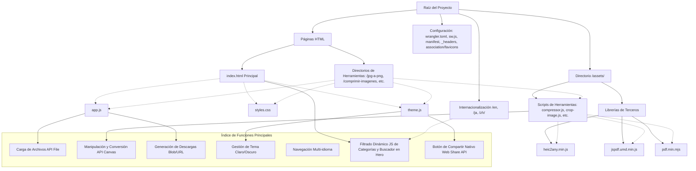

# Grafo de Dependencias - Convertify

```mermaid
graph TD
    %% Nodos principales
    Root[Raíz del Proyecto] --> HTML_Pages[Páginas HTML]
    Root --> Assets[Directorio /assets/]
    Root --> Locales[Internacionalización /en, /ja, /zh/]
    Root --> Config[Configuración: wrangler.toml, sw.js, manifest, _headers, association/favicons]

    %% Páginas y Herramientas
    HTML_Pages --> Index[index.html Principal]
    HTML_Pages --> ToolsDirs[Directorios de Herramientas: /jpg-a-png, /comprimir-imagenes, etc.]
    
    %% Relación de assets a páginas
    Index -.-> Styles[styles.css]
    Index -.-> AppJS[app.js]
    Index -.-> ThemeJS[theme.js]
    
    ToolsDirs -.-> Styles
    ToolsDirs -.-> AppJS
    ToolsDirs -.-> ThemeJS

    %% Lógica de Herramientas en /assets/
    Assets --> ToolScripts[Scripts de Herramientas: compressor.js, crop-image.js, etc.]
    ToolsDirs -.-> ToolScripts

    %% Dependencias de Librerías
    Assets --> Libs[Librerías de Terceros]
    Libs --> Heic2Any[heic2any.min.js]
    Libs --> JsPDF[jspdf.umd.min.js]
    Libs --> PDFjs[pdf.min.mjs]

    %% Flujos de dependencia
    ToolScripts -.-> Heic2Any
    ToolScripts -.-> JsPDF
    ToolScripts -.-> PDFjs

    %% Índice de Funciones (Lógico)
    subgraph Índice de Funciones Principales
        F_Load[Carga de Archivos API File]
        F_Canvas[Manipulación y Conversión API Canvas]
        F_Download[Generación de Descargas Blob/URL]
        F_Theme[Gestión de Tema Claro/Oscuro]
        F_I18n[Navegación Multi-idioma]
        F_Filter[Filtrado Dinámico JS de Categorías y Buscador en Hero]
        F_Share[Botón de Compartir Nativo Web Share API]
    end
    
    AppJS --> F_Load
    AppJS --> F_Download
    ThemeJS --> F_Theme
    ThemeJS --> F_Share
    ToolScripts --> F_Canvas
    Index --> F_Filter
    Locales -.-> F_Filter
```
